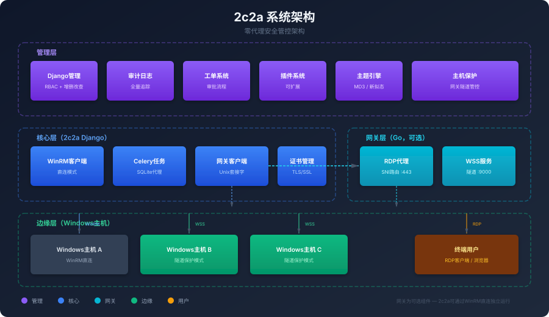

<div align="center">


<h1>2c2a - Cloudy Computer Account Activation Integration Platform</h1>

<p>
  <strong>基于 FastAPI + Huey 的企业级 Windows 主机远程管理平台</strong><br>
  全异步架构 · WinRM 直连 · Gateway 隧道保护 · 极致性能
</p>

<p>
  
  
  
  
  
  
</p>

</div>

---

## 架构升级说明

本项目已从 Django + Celery 全面重构为 **FastAPI + Huey** 架构，核心改进：

| 维度 | Django + Celery | FastAPI + Huey |
|------|-----------------|----------------|
| **并发模型** | WSGI 同步阻塞 | ASGI 全异步非阻塞 |
| **请求处理** | 同步 I/O，阻塞前端 | async/await，零阻塞 |
| **任务队列** | Celery (重量级) | Huey (轻量高效) |
| **ORM** | Django ORM (同步) | SQLAlchemy 2.0 (异步) |
| **数据库驱动** | psycopg2 (同步) | asyncpg (异步) |
| **认证** | Django Session | JWT + Redis Session 双模式 |
| **性能** | 中等并发 | 高并发，低延迟 |

---

## 核心特性


- **全异步架构**：FastAPI + asyncpg + SQLAlchemy async，请求处理不阻塞，极致性能
- **零代理架构**：无需在目标主机安装客户端软件，通过 WinRM 协议直接管控
- **Gateway 隧道保护**：可选部署 Gateway，为零公网 IP 主机提供安全 RDP 访问
- **Huey 轻量队列**：比 Celery 资源占用少 10 倍，启动快，适合本项目规模
- **Material Design 3**：现代化的前端用户体验，支持多主题切换
- **RBAC 权限控制**：细粒度的角色和权限管理，满足企业合规要求
- **安全审计**：完整的操作日志和安全监控，支持行为分析
- **松耦合设计**：Gateway 为可选组件，2c2a 可独立运行

## 系统架构



2c2a 采用四层架构设计：

| 层级 | 组件 | 说明 |
|------|------|------|
| **管理层** | FastAPI Admin 路由 | RBAC、审计、工单、插件、主题、主机保护配置 |
| **核心层** | 2c2a FastAPI | WinRM 客户端、Huey 任务、GatewayClient、证书管理 |
| **网关层** | Gateway (Go) | RDP 代理 (SNI 路由)、WSS 隧道服务、控制面 (可选) |
| **边缘层** | 2c2a-tunnel (Go) | Windows 服务、WSS 客户端、多路复用、远程执行 |

> **Gateway 为可选组件**：不部署 Gateway 时，2c2a 通过 WinRM 直连管理主机，功能完全可用。部署 Gateway 后可启用主机保护模式，实现零公网 IP 的安全 RDP 访问。

## 生态项目

| 项目 | 语言 | 说明 |
|------|------|------|
| [2c2a](.) | Python/FastAPI | 核心管理平台，Web 后台 + API |
| [Gateway](../gateway) | Go | 隧道网关，RDP 代理 + WSS 服务 + 控制面 |
| [Tunnel](../tunnel) | Go | 边缘代理，Windows 服务 + WSS 客户端 |

## 快速开始

### 环境要求

- Python 3.11+
- PostgreSQL 12+
- Redis 6+

### 环境配置

1. **复制环境配置文件**

```bash
cp .env.example .env
```

2. **编辑 .env 文件**

```bash
nano .env
```

3. **关键配置项说明**

```bash
DEBUG=true
SECRET_KEY=your-secret-key-here-32-chars-minimum!!

# 数据库配置 (PostgreSQL)
DB_HOST=localhost
DB_PORT=5432
DB_NAME=2c2a
DB_USER=postgres
DB_PASSWORD=your_password

# Redis
REDIS_URL=redis://localhost:6379/0

# Huey
HUEY_REDIS_DB=1

# Gateway (可选)
GATEWAY_ENABLED=false
GATEWAY_CONTROL_SOCKET=/run/2c2a/control.sock

# 演示模式
DEMO_MODE=false
```

### 开发环境搭建

```bash
git clone https://github.com/2c2a/2c2a.git
cd 2c2a

# 安装依赖
pip install -e ".[dev]"

# 创建数据库表
python run.py migrate

# 启动 Web 服务器（热重载）
python run.py web --reload --port 8000

# 另开一个终端启动 Huey Worker
python run.py worker
```

访问 `http://127.0.0.1:8000/` 进入平台。

### 生产环境部署

```bash
# 1. 安装依赖
pip install -e .

# 2. 配置环境变量
cp .env.example .env
# 编辑 .env，设置 DEBUG=false, SECRET_KEY, DB_PASSWORD 等

# 3. 创建数据库表
python run.py migrate

# 4. 启动 Web 服务器（多 Worker）
python run.py web --host 0.0.0.0 --port 8000 --workers 4

# 5. 启动 Huey Worker（处理异步任务）
python run.py worker

# 或使用 start.sh 脚本
./start.sh web      # 启动 Web
./start.sh worker   # 启动 Worker
./start.sh beat     # 启动定时任务调度器
```

### 启用 Gateway（可选）

```bash
# 1. 构建并启动 Gateway
cd ../gateway
go build -o 2c2a-gateway ./cmd/gateway/
./2c2a-gateway -config configs/gateway.yaml

# 2. 在 2c2a .env 中启用
GATEWAY_ENABLED=true

# 3. 为主机生成 Tunnel Token
# 通过管理后台操作
```

### 部署 Tunnel 到 Windows 主机

```bash
# 下载 2c2a-tunnel.exe (从 GitHub Release)
# 或通过 CI/CD 自动打包

2c2a-tunnel.exe install \
  -token <TOKEN> \
  -server wss://gateway.example.com:9000
```

## 项目结构

```
2c2a/
├── app/                    # 应用核心
│   ├── config.py          # pydantic-settings 配置
│   ├── database.py        # SQLAlchemy 异步引擎 + 连接池
│   ├── huey_config.py     # Huey Redis 配置
│   ├── dependencies.py    # FastAPI 依赖注入（认证、分页）
│   ├── main.py            # FastAPI 入口 + 生命周期 + 中间件
│   ├── models/            # SQLAlchemy 2.0 数据模型 (12 文件, 38 类)
│   │   ├── user.py
│   │   ├── host.py
│   │   ├── product.py
│   │   ├── dashboard.py
│   │   ├── certificate.py
│   │   ├── audit.py
│   │   ├── task.py
│   │   ├── theme.py
│   │   ├── ticket.py
│   │   ├── bootstrap.py
│   │   └── plugin.py
│   ├── schemas/           # Pydantic v2 请求/响应模型 (12 文件, 82 类)
│   ├── routers/           # FastAPI 路由 (14 文件, 88 路由)
│   │   ├── accounts.py
│   │   ├── hosts.py
│   │   ├── operations.py
│   │   ├── dashboard.py
│   │   ├── certificates.py
│   │   ├── bootstrap.py
│   │   ├── audit.py
│   │   ├── tasks.py
│   │   ├── themes.py
│   │   ├── tickets.py
│   │   ├── tunnel.py
│   │   ├── provider.py
│   │   └── pages.py
│   ├── tasks/             # Huey 异步任务 (5 文件, 28+ 任务)
│   │   ├── bootstrap.py
│   │   ├── operations.py
│   │   ├── hosts.py
│   │   └── maintenance.py
│   ├── services/          # 业务服务层 (10 模块)
│   │   ├── auth.py        # JWT + Session 认证
│   │   ├── crypto.py      # Fernet 对称加密
│   │   ├── redis_helper.py # Redis 连接池
│   │   ├── cert_service.py # 证书签发 (ECC P-256)
│   │   ├── cert_storage.py # 证书文件存储
│   │   ├── winrm_client.py # WinRM 远程客户端
│   │   ├── gateway_client.py # Gateway 客户端
│   │   ├── disk_quota.py   # 磁盘配额管理
│   │   ├── email_service.py # 邮件发送
│   │   └── local_winserver_client.py # 本地 Windows 客户端
│   ├── middleware/         # 中间件 (4 个)
│   │   ├── security.py     # 安全头 (CSP, HSTS, X-Frame-Options)
│   │   ├── maintenance.py  # 维护模式
│   │   ├── site_group.py   # 站点组解析
│   │   └── rate_limit.py   # Redis 限流
│   └── utils/              # 工具函数
│       └── helpers.py
├── alembic/                # 数据库迁移
├── docs/                   # 技术文档
├── static/                 # 静态文件 (CSS, JS, 图片)
├── templates/              # Jinja2 模板
├── run.py                  # 启动脚本 (web/worker/beat/migrate/shell)
├── start.sh                # Shell 启动脚本
├── pyproject.toml          # 项目依赖配置
└── .env.example            # 环境变量模板
```

## 性能特性

- **全异步 I/O**：FastAPI + asyncpg + SQLAlchemy async，请求处理不阻塞
- **连接池**：SQLAlchemy 连接池 (pool_size=20, max_overflow=10, pool_recycle=300)
- **Redis 会话**：零 DB 查询的会话验证，JWT + Cookie 双模式
- **Huey 轻量队列**：比 Celery 资源占用少 10 倍，启动快
- **非阻塞前端**：所有耗时操作（WinRM、证书签发）通过 Huey 异步执行，前端立即返回
- **Redis 限流**：固定窗口计数器，O(1) 复杂度

## 文档目录

详细的项目文档请查看 [`docs/`](./docs) 目录：

- [开发规范指南](./docs/00_开发规范指南.md) - 强制执行的开发标准
- [项目架构与设计](./docs/01_项目架构与设计.md) - 系统架构和技术选型
- [API接口文档](./docs/02_API接口文档.md) - RESTful API 详细说明
- [Database Schema](./docs/03_Database_Schema.md) - 数据库设计和表结构
- [部署运维手册](./docs/04_部署运维手册.md) - 生产环境部署指南
- [更新日志](./docs/05_更新日志.md) - 版本发布历史
- [安全配置指南](./docs/06_安全配置指南.md) - 安全策略和防护措施

## 安全特性

- 基于角色的访问控制 (RBAC)
- 数据传输加密 (TLS/SSL)
- 敏感信息加密存储 (Fernet)
- 完整的操作审计日志（含隧道/RDP事件）
- JWT + Session 双认证模式
- Redis 固定窗口限流
- 防暴力破解机制
- 安全启动和会话管理
- 主机保护模式（Gateway 隧道隔离）
- Ed25519 密钥交换

## 贡献指南

我们欢迎任何形式的贡献！请先阅读我们的[开发规范指南](./docs/00_开发规范指南.md)。

### 分支规范（分阶段发布模型）

本项目采用 **5 级分阶段分支模型**，所有生态仓库统一遵循：

| 分支 | 阶段 | 用途 | 部署环境 |
|------|------|------|----------|
| `master` | 生产版本 | 线上稳定运行，仅接受 hotfix 合并 | 生产服务器 |
| `beta` | 公测版本 | 服务器端集成测试，QA 验证通过后方可合入 master | 预发布/测试服务器 |
| `alpha` | 内测版本 | 本地开发机测试，功能验证与联调 | 本地开发环境 |
| `hotfix` | 热修补 | 紧急修复线上问题，从 master 切出 | 临时生产修复 |
| `feat` | 功能开发 | 新功能迭代分支，开发完成后合并至 alpha | 本地开发环境 |

**合并流向**：`feat` → `alpha` → `beta` → `master`，`hotfix` 可直接回灌各分支。

### 开发流程

1. Fork 项目
2. 从 `feat` 切出功能子分支 (`git checkout -b feat/xxx origin/feat`)
3. 开发完成后合并至 `alpha` 进行本地测试
4. 通过测试后提 PR 合并至 `beta` 进行服务器公测
5. QA 通过后由维护者合并至 `master` 发布

## 许可证

本项目采用 AGPL-3.0 许可证 - 查看 [LICENSE](LICENSE) 文件了解详情。

## 联系我们

- 组织主页: https://github.com/2c2a
- 2c2a 仓库: https://github.com/2c2a/2c2a
- 问题反馈: [GitHub Issues](https://github.com/2c2a/2c2a/issues)

---

<div align="center">

*2c2a - 让 Windows 主机管理更简单、更安全、更快速*

</div>
